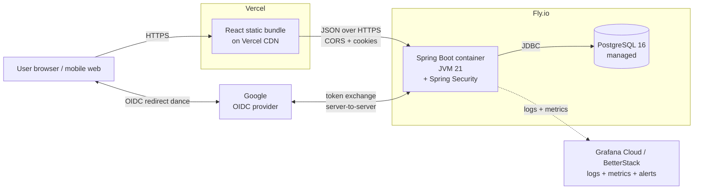

# Todo App

A production-grade full-stack todo application built end-to-end with Java/Spring Boot, React/TypeScript, PostgreSQL, Docker, GitHub Actions, and deployed on Fly.io + Vercel.

> **Status:** In active development. See [`todo-app-implementation-plan.md`](./todo-app-implementation-plan.md) for the phase-by-phase build plan and current progress.

## Live URLs

_(Populated in Phase 16 once deployed.)_

- **App:** TBD
- **API:** TBD
- **API docs (Swagger UI):** TBD

## Tech Stack

| Layer | Technology |
|-------|-----------|
| Backend | Java 21 LTS · Spring Boot 3.5 · Maven |
| Database | PostgreSQL 16 · Flyway migrations |
| Auth | Spring Security · OIDC (Google) — *Phase 6* |
| Frontend | React 18 · TypeScript (strict) · Vite · Tailwind CSS · TanStack Query |
| Testing (BE) | JUnit 5 · Mockito · Testcontainers |
| Testing (FE) | Vitest · React Testing Library · Playwright |
| Containers | Docker · Docker Compose |
| CI/CD | GitHub Actions · GitHub Container Registry |
| Hosting | Fly.io (backend + Postgres) · Vercel (frontend) |
| Observability | Logback JSON · Spring Actuator · Micrometer |

## Architecture (production topology)



## User Workflow

_(Populated in Phase 9 once UI/UX is designed.)_

## Local Development

### Prerequisites

- **JDK 21 LTS** (Temurin) via [SDKMAN](https://sdkman.io)
- **Maven 3.9+** (the project ships a Maven wrapper, so any modern Maven works)
- **Docker Desktop** — required for the dev database and for running tests (Testcontainers)
- **Git** and **GitHub CLI** (`gh`)
- *(Frontend phases:)* **Node.js 22+** and **pnpm 10+**

> **macOS Docker PATH gotcha:** if `which docker` returns nothing after installing Docker Desktop, run
> `sudo ln -sf /Applications/Docker.app/Contents/Resources/bin/docker /usr/local/bin/docker` to expose the CLI on PATH.

### Clone

```bash
git clone https://github.com/pranavgupta97/todo-app.git
cd todo-app
```

### Running the backend

There are **two supported run modes** for local dev — pick whichever fits your workflow.

#### Mode 1 · Auto-managed (recommended for normal dev)

Spring Boot's Docker Compose support starts the Postgres container when the app boots and stops it when the app exits. Database state is wiped between restarts.

```bash
cd backend
./mvnw spring-boot:run
```

Verify:

```bash
curl -s localhost:8080/actuator/health | jq
# {"status":"UP","groups":["liveness","readiness"]}
```

Stop the app with `Ctrl+C` — Postgres stops with it.

#### Mode 2 · Manual DB lifecycle

Useful when you want the DB to outlive app restarts — e.g. iterating on Flyway migrations, inspecting state between runs, or pointing multiple processes at the same DB.

```bash
# Terminal 1 — start Postgres in the background
docker compose -f infra/docker-compose.dev.yml up -d

# Terminal 2 — run the app (it will detect the already-running compose stack)
cd backend
./mvnw spring-boot:run
```

When you're done:

```bash
docker compose -f infra/docker-compose.dev.yml down       # stop, keep volume
docker compose -f infra/docker-compose.dev.yml down -v    # stop + wipe DB state
```

### Running the tests

Tests use Testcontainers to spin up a fresh Postgres container per test class — independent of the dev DB above. Docker Desktop must be running.

```bash
cd backend
./mvnw clean verify
```

> Comprehensive unit + integration test suites land in **Phase 7** (after auth in Phase 6). The Phase 3 smoke test (`TodoAppApplicationTests`) provides baseline coverage today.

### Connecting to the dev database from IntelliJ Database tool

When the dev compose stack is running (either mode), connect with:

| Setting | Value |
|---------|-------|
| Host | `localhost` |
| Port | `5433` *(not 5432, to avoid conflicting with locally-installed Postgres)* |
| Database | `mydatabase` |
| User | `myuser` |
| Password | `secret` |

### Manually exercising the API

Open `backend/requests/todos.http` in IntelliJ and click the green ▶ next to any request. The file covers all 5 endpoints plus validation errors, 404s, and bad query params.

Or with `curl`:

```bash
curl -s -X POST localhost:8080/api/todos \
  -H 'Content-Type: application/json' \
  -d '{"title":"Buy almond milk"}' | jq

curl -s 'localhost:8080/api/todos?status=active' | jq
```

## Deployment

_(Instructions added in Phase 16.)_

## Project Structure

```
todo-app/
├── backend/                             # Spring Boot API (Phase 3)
├── frontend/                            # React app (Phase 10)
├── infra/                               # Docker Compose, fly.toml, etc. (started Phase 5)
├── docs/                                # Architecture diagrams, design assets
├── .github/workflows/                   # CI/CD (Phase 15)
└── todo-app-implementation-plan.md      # Living build plan + decision log
```

## License

[MIT](./LICENSE) © 2026 Pranav Gupta
