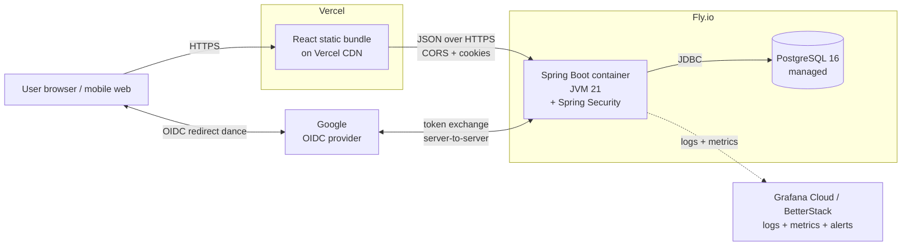

# Todo App

A production-grade full-stack todo application built end-to-end with Java/Spring Boot, React/TypeScript, PostgreSQL, Docker, GitHub Actions, and deployed on Fly.io + Vercel.

> **Status:** In active development. See [`todo-app-implementation-plan.md`](./todo-app-implementation-plan.md) for the phase-by-phase build plan and current progress.

## Live URLs

_(Populated in Phase 16 once deployed.)_

- **App:** TBD
- **API:** TBD
- **API docs (Swagger UI):** TBD

## Tech Stack

| Layer | Technology |
|-------|-----------|
| Backend | Java 21 LTS · Spring Boot 3.5 · Maven |
| Database | PostgreSQL 16 · Flyway migrations |
| Auth | Spring Security · OIDC (Google) — *Phase 6* |
| Frontend | React 18 · TypeScript (strict) · Vite · Tailwind CSS · TanStack Query |
| Testing (BE) | JUnit 5 · Mockito · Testcontainers |
| Testing (FE) | Vitest · React Testing Library · Playwright |
| Containers | Docker · Docker Compose |
| CI/CD | GitHub Actions · GitHub Container Registry |
| Hosting | Fly.io (backend + Postgres) · Vercel (frontend) |
| Observability | Logback JSON · Spring Actuator · Micrometer |

## Architecture (production topology)



## User Workflow

_(Populated in Phase 9 once UI/UX is designed.)_

## Local Development

### Prerequisites

- **JDK 21 LTS** (Temurin) via [SDKMAN](https://sdkman.io)
- **Maven 3.9+** (the project ships a Maven wrapper, so any modern Maven works)
- **Docker Desktop** — required for the dev database and for running tests (Testcontainers)
- **Git** and **GitHub CLI** (`gh`)
- *(Frontend phases:)* **Node.js 22+** and **pnpm 10+**

> **macOS Docker PATH gotcha:** if `which docker` returns nothing after installing Docker Desktop, run
> `sudo ln -sf /Applications/Docker.app/Contents/Resources/bin/docker /usr/local/bin/docker` to expose the CLI on PATH.

### Clone

```bash
git clone https://github.com/pranavgupta97/todo-app.git
cd todo-app
```

### Running the backend

There are **two supported run modes** for local dev — pick whichever fits your workflow.

#### Mode 1 · Auto-managed (recommended for normal dev)

Spring Boot's Docker Compose support starts the Postgres container when the app boots and stops it when the app exits. Database state is wiped between restarts.

```bash
cd backend
./mvnw spring-boot:run
```

Verify:

```bash
curl -s localhost:8080/actuator/health | jq
# {"status":"UP","groups":["liveness","readiness"]}
```

Stop the app with `Ctrl+C` — Postgres stops with it.

#### Mode 2 · Manual DB lifecycle

Useful when you want the DB to outlive app restarts — e.g. iterating on Flyway migrations, inspecting state between runs, or pointing multiple processes at the same DB.

```bash
# Terminal 1 — start Postgres in the background
docker compose -f infra/docker-compose.dev.yml up -d

# Terminal 2 — run the app (it will detect the already-running compose stack)
cd backend
./mvnw spring-boot:run
```

When you're done:

```bash
docker compose -f infra/docker-compose.dev.yml down       # stop, keep volume
docker compose -f infra/docker-compose.dev.yml down -v    # stop + wipe DB state
```

### Running the tests

Tests use Testcontainers to spin up a fresh Postgres container per test class — independent of the dev DB above. Docker Desktop must be running.

```bash
cd backend
./mvnw clean verify
```

> Comprehensive unit + integration test suites land in **Phase 7** (after auth in Phase 6). The Phase 3 smoke test (`TodoAppApplicationTests`) provides baseline coverage today.

### Connecting to the dev database from IntelliJ Database tool

When the dev compose stack is running (either mode), connect with:

| Setting | Value |
|---------|-------|
| Host | `localhost` |
| Port | `5433` *(not 5432, to avoid conflicting with locally-installed Postgres)* |
| Database | `mydatabase` |
| User | `myuser` |
| Password | `secret` |

### Manually exercising the API

After **Phase 6 (auth)**, every `/api/**` endpoint requires a logged-in session — see [Authentication](#authentication) below for the one-time setup. Once that's done, the `todos.http` file in `backend/requests/` (covering all endpoints — CRUD, filters, validation errors, 404s) is fully runnable from inside IntelliJ via the env-file workflow described in [Local API testing workflow](#local-api-testing-workflow-intellij-http-client).

## Authentication

Every `/api/**` endpoint requires a logged-in session. Sign-in uses **Google's OIDC** via Spring Security OAuth2 Client.

### One-time setup (local dev)

1. **Provision a Google OAuth client** in [Google Cloud Console](https://console.cloud.google.com/):
   - Create a project: `todo-app-dev`
   - **OAuth consent screen** → External · App name: "Todo App (dev)" · Scopes: `openid email profile` · add your Gmail as a test user
   - **Credentials** → Create OAuth client ID → Web application
     - Authorized redirect URI: **`http://localhost:8080/login/oauth2/code/google`**
   - Save the Client ID and Client Secret

2. **Drop credentials into `backend/.env`** (copy from `.env.example`, then edit):
   ```bash
   cp backend/.env.example backend/.env
   # then edit backend/.env and fill in the real values
   ```
   `.env` is gitignored — never commit it.

3. **Load env vars before running the app**:
   ```bash
   set -a && source backend/.env && set +a
   cd backend && ./mvnw spring-boot:run
   ```
   Or paste the variables into IntelliJ's run-config "Environment variables" field.

### Logging in

1. Run the app (above).
2. Visit **`http://localhost:8080/api/me`** in your browser. Spring Security intercepts the unauthenticated request and redirects you to Google.
3. Sign in with the Gmail you added as a test user in GCP.
4. You're redirected back to `/api/me` with a `JSESSIONID` cookie set; subsequent browser visits to `/api/**` carry it automatically.

### Local API testing workflow (IntelliJ HTTP Client)

The `backend/requests/todos.http` file is wired to use the JetBrains HTTP Client's environment-file system for cookie management. After a one-time browser login each session, paste your `JSESSIONID` into a private (gitignored) env file and every request in `todos.http` automatically picks it up.

1. **Log in via browser** (steps 1–3 above).

2. **Grab `JSESSIONID`** from browser DevTools → Application → Cookies → `localhost:8080`. Copy the value.

3. **Set up the private env file once**:
   ```bash
   cp backend/requests/http-client.private.env.json.example \
      backend/requests/http-client.private.env.json
   ```
   Edit `http-client.private.env.json` and paste your real `JSESSIONID`. (The file is gitignored.)

4. **Run requests**: open `backend/requests/todos.http` in IntelliJ, pick the **`dev`** environment from the toolbar (top-right of the editor), then click ▶ next to any request. **Every request — including POST/PATCH/DELETE — works with just the session cookie**, because the dev profile disables CSRF (see below).

When the cookie expires (server restart, logout, etc.), repeat steps 1–3.

### Why CSRF is off in dev (and on everywhere else)

CSRF protection defends against attackers tricking a logged-in user's browser into making cross-site requests with their cookies. **On `localhost`, you're the only user — there are no cross-site attackers — so CSRF adds friction with no security benefit.** Standard practice in many teams.

The dev profile sets `app.security.csrf.enabled: false`. The base config (used by the test profile and prod) keeps it on:
- **Tests** (Phase 7) exercise CSRF behavior properly via Spring Security test support.
- **Production** has CSRF on; the React frontend (Phase 11) handles the `XSRF-TOKEN` cookie + `X-XSRF-TOKEN` header echo automatically. Real users never see this.

If you ever want to test CSRF behavior locally (manually validating the production posture), comment out the `app.security.csrf.enabled` block in `application-dev.yml` and restart.

### Inspecting the current session via `curl`

```bash
# In dev (CSRF off): just the cookie is enough.
curl -s --cookie "JSESSIONID=<JSESSIONID>" localhost:8080/api/me | jq
# {"id":2,"email":"you@gmail.com","displayName":"Your Name"}
```

### Logging out

```bash
# Dev — CSRF off
curl -s -X POST --cookie "JSESSIONID=<JSESSIONID>" localhost:8080/logout

# Prod / base config — CSRF on, must echo the XSRF-TOKEN cookie as a header
curl -s -X POST \
  --cookie "JSESSIONID=<JSESSIONID>; XSRF-TOKEN=<XSRF>" \
  --header "X-XSRF-TOKEN: <XSRF>" \
  https://<host>/logout
```

## Deployment

_(Instructions added in Phase 16.)_

## Project Structure

```
todo-app/
├── backend/                             # Spring Boot API (Phase 3)
├── frontend/                            # React app (Phase 10)
├── infra/                               # Docker Compose, fly.toml, etc. (started Phase 5)
├── docs/                                # Architecture diagrams, design assets
├── .github/workflows/                   # CI/CD (Phase 15)
└── todo-app-implementation-plan.md      # Living build plan + decision log
```

## License

[MIT](./LICENSE) © 2026 Pranav Gupta
