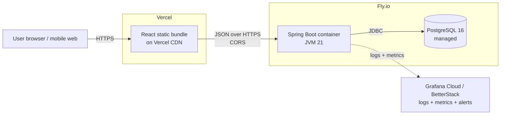

# Todo App

A production-grade full-stack todo application built end-to-end with Java/Spring Boot, React/TypeScript, PostgreSQL, Docker, GitHub Actions, and deployed on Fly.io + Vercel.

> **Status:** In active development. See [`todo-app-implementation-plan.md`](./todo-app-implementation-plan.md) for the phase-by-phase build plan and current progress.

## Live URLs

_(Populated in Phase 15 once deployed.)_

- **App:** TBD
- **API:** TBD
- **API docs (Swagger UI):** TBD

## Tech Stack

| Layer | Technology |
|-------|-----------|
| Backend | Java 21 LTS · Spring Boot 3.4 · Maven |
| Database | PostgreSQL 16 · Flyway migrations |
| Frontend | React 18 · TypeScript (strict) · Vite · Tailwind CSS · TanStack Query |
| Testing (BE) | JUnit 5 · Mockito · Testcontainers |
| Testing (FE) | Vitest · React Testing Library · Playwright |
| Containers | Docker · Docker Compose |
| CI/CD | GitHub Actions · GitHub Container Registry |
| Hosting | Fly.io (backend + Postgres) · Vercel (frontend) |
| Observability | Logback JSON · Spring Actuator · Micrometer |

## Architecture (production topology)



## User Workflow

_(Populated in Phase 8 once UI/UX is designed.)_

## Getting Started (Local Development)

> This section grows as each phase completes. Full setup is tracked in the [implementation plan](./todo-app-implementation-plan.md).

### Prerequisites
- **JDK 21 LTS** (Temurin) via [SDKMAN](https://sdkman.io)
- **Maven 3.9+**
- **Node.js 22+** and **pnpm 10+**
- **Docker Desktop**
- **Git** and **GitHub CLI** (`gh`)

### Clone
```bash
git clone https://github.com/pranavgupta97/todo-app.git
cd todo-app
```

### Running the stack locally
_(Instructions added in Phase 12 when Docker Compose is wired up.)_

## Testing
_(Instructions added in Phases 6 and 11.)_

## Deployment
_(Instructions added in Phase 15.)_

## Project Structure
```
todo-app/
├── backend/                             # Spring Boot API (added in Phase 3)
├── frontend/                            # React app (added in Phase 9)
├── infra/                               # Docker Compose, fly.toml, etc. (added in Phase 12)
├── docs/                                # Architecture diagrams, design assets
├── .github/workflows/                   # CI/CD (added in Phase 14)
└── todo-app-implementation-plan.md      # Living build plan + decision log
```

## License

[MIT](./LICENSE) © 2026 Pranav Gupta
