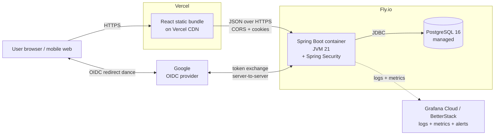
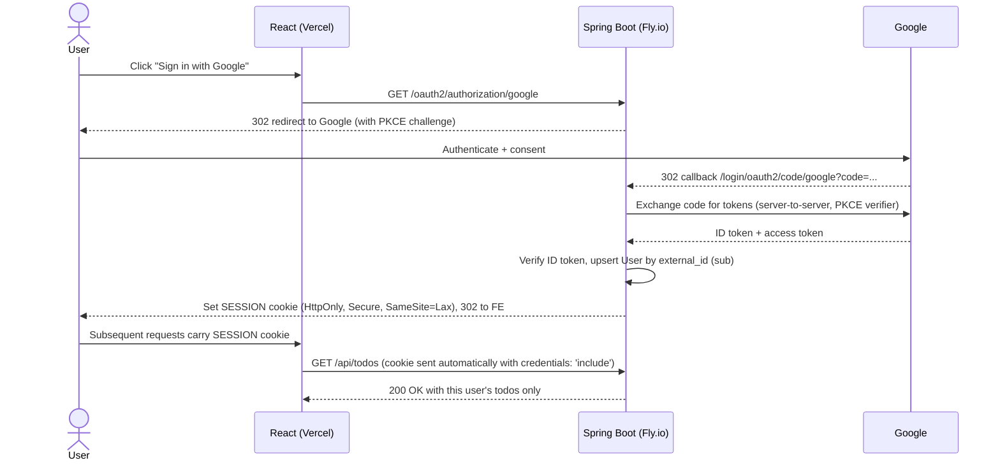

# Todo App — Implementation Plan

> **Living document.** Updated at the end of every logical unit. This file is the single source of truth for what we're building, why, how far we've gotten, and what's next.
>
> **Cold-start contract:** A fresh Claude session must be able to pick up the project from this file alone. If it isn't here, it isn't tracked. If you change scope, update this file in the same commit.

---

## Table of Contents
1. [Overview](#1-overview)
2. [Learning Objectives](#2-learning-objectives)
3. [Architecture](#3-architecture)
4. [Technology Choices](#4-technology-choices)
5. [Phase Plan](#5-phase-plan)
6. [Decision Log](#6-decision-log)
7. [Local Dev Guide](#7-local-dev-guide)
8. [Deployment Notes](#8-deployment-notes)
9. [Open Questions](#9-open-questions)
10. [Collaboration Conventions](#10-collaboration-conventions)
11. [Session Log](#11-session-log)

---

## 1. Overview

### What we're building
A standard todo-list web application with the usual features — create, read, update, delete, toggle-complete, filter — accessible from desktop browsers and mobile web, with **Google sign-in (OIDC) authentication** so each user sees their own todos. Data persists across sessions.

### Why we're building it
This is a deliberate **learning project** for the author (GitHub: [`pranavgupta97`](https://github.com/pranavgupta97)), a senior software engineer with ~6 years of experience across the stack who has worked on complex systems with nuanced focus domains specializing primarily in back-end engineering and development, but has never personally taken a full-stack application system (with all its major database, back-end, and front-end components) from an empty repo all the way through to production deployment. The todo app itself is intentionally small so that the *engineering discipline around it* — architecture, authentication, testing, CI/CD, containerization, hosting, observability — can be built out in full without application-domain complexity competing for attention.

### Success criteria
- Publicly accessible on the open internet via HTTPS (Vercel + Fly.io).
- Users can sign in with their Google account; each user sees only their own todos.
- All code is typed, tested, linted, and merged through pull requests.
- Automated CI on every push; automated deploy on merge to `main`.
- Structured logs and metrics visible in production.
- A developer can clone, set up, and run the full stack locally using the README alone.
- Every item in §2 (Learning Objectives) is checked off.

### Scope discipline
- **In scope (v1):** CRUD on todos · completion toggle · filtering (all / active / completed) · dark mode · persistence · responsive mobile-web-friendly layout · **Google OIDC authentication** · per-user data isolation.
- **Out of scope (v1):** sharing/collaboration on todos · reminders or notifications · offline support · native mobile apps · todo `description` / `due_date` / `priority` fields · multiple identity providers (only Google in v1; the `external_id`+`email` schema design accommodates adding GitHub / Microsoft / Auth0 later without migration).

---

## 2. Learning Objectives

Checklist of concepts the author expects to have internalized by end of the project. Items are ticked off as they are demonstrably complete in the code + docs.

### Backend & Java
- [ ] Spring Boot 3.x project structure, IoC/DI, bean lifecycle
- [ ] Layered architecture: Controller → Service → Repository
- [ ] RESTful API design (resources, HTTP verbs, status codes, idempotency)
- [ ] DTO vs entity separation and why it matters
- [ ] Bean Validation (`jakarta.validation`) and validation-error mapping
- [ ] Global error handling via `@ControllerAdvice` with RFC 7807 `ProblemDetail`
- [ ] Spring profiles for environment-based config (`dev`, `test`, `prod`)
- [ ] Java 21 records used as DTOs (immutable, no boilerplate)

### Database & Persistence
- [ ] Relational schema design for a small multi-table domain (users + todos with FK)
- [ ] JPA/Hibernate entity mapping and generated-SQL awareness
- [ ] Flyway migrations — versioning, naming, forward-only discipline, idempotence-of-result
- [ ] Schema-evolution thinking (designing v1 to anticipate auth, avoiding back-added FK columns)
- [ ] PostgreSQL fundamentals in dev (Docker) and prod (Fly managed)
- [ ] Connection pooling (HikariCP) basics
- [ ] `TIMESTAMPTZ` vs `TIMESTAMP`; why `updated_at` defaults to `NOW()` not NULL

### Authentication & Security
- [ ] OAuth 2.0 / OIDC protocol fundamentals (authorization-code flow, PKCE, ID tokens, scopes)
- [ ] Spring Security 6.x configuration (security filter chain, `SecurityFilterChain` bean)
- [ ] Spring Security OAuth2 Client with Google as identity provider
- [ ] Google Cloud Console: OAuth client ID provisioning, redirect URIs, consent screen
- [ ] Session-based auth (server-side `SESSION` cookie) vs JWT — and why sessions win for an OIDC client app with a same-origin frontend
- [ ] Cookie security (`HttpOnly`, `Secure`, `SameSite=Lax`/`None`)
- [ ] CSRF protection — when needed, when not, how Spring handles it
- [ ] Authorization filtering — every endpoint scoped to the authenticated user (`user_id` from `Principal`)
- [ ] Frontend handling of redirect-based login flow (no token juggling)
- [ ] Tests with `@WithMockUser` / `SecurityMockMvcConfigurers` for authenticated requests

### Frontend & TypeScript
- [ ] React 18 with strict-mode TypeScript
- [ ] Vite build tool
- [ ] Tailwind CSS utility-first styling
- [ ] Dark-mode implementation (class strategy, system-preference default, localStorage persistence)
- [ ] TanStack Query for server-state caching
- [ ] TypeScript client generated from OpenAPI spec (shared contract)
- [ ] Login redirect UX (browser → `/oauth2/authorization/google` → Google → callback → app)
- [ ] Conditional rendering based on authenticated session state
- [ ] Accessible, responsive layout

### Testing
- [ ] JUnit 5 unit tests with Mockito
- [ ] `@WebMvcTest` controller tests (with security context)
- [ ] `@SpringBootTest` integration tests with Testcontainers (real Postgres)
- [ ] Spring Security test support — mocking authenticated principals
- [ ] Vitest + React Testing Library for component/hook tests
- [ ] Playwright end-to-end test for one happy-path user journey (incl. mocked login)

### DevOps & Deployment
- [ ] Docker images — layers, caching, multi-stage builds
- [ ] Dockerfile for Spring Boot (JVM multi-stage)
- [ ] Dockerfile for React static build (nginx-served)
- [ ] Docker Compose for local multi-service orchestration
- [ ] GitHub Actions — workflows, jobs, caches, secrets, matrix
- [ ] Container image publishing to GHCR
- [ ] Fly.io deployment — `fly.toml`, secrets, regions, volumes, scaling
- [ ] Vercel deployment — build config, env vars, preview deploys
- [ ] Managed Postgres in production
- [ ] TLS/HTTPS termination (platform-managed)
- [ ] Per-environment OAuth client configuration (dev vs prod redirect URIs)

### Cross-cutting Concerns
- [ ] CORS — preflights, allowed origins, **credentialed requests** (cookies require `withCredentials: true` and explicit `Access-Control-Allow-Credentials`)
- [ ] Environment-based config — `.env` files, secrets handling, dev vs prod separation
- [ ] API versioning and backward-compatibility thinking
- [ ] Structured JSON logging with correlation IDs (and authenticated-user ID where present)
- [ ] Metrics via Micrometer + Spring Actuator
- [ ] Health / readiness / liveness endpoints
- [ ] Production observability — log aggregation + alerting (Grafana Cloud or BetterStack)
- [ ] Git workflow — feature branches, PRs, protected main, commit hygiene
- [ ] System-architecture diagramming (Mermaid)
- [ ] Writing a comprehensive README with diagrams

---

## 3. Architecture

### Production topology



### Component responsibilities

| Component | Responsibility |
|---|---|
| **React frontend (Vercel)** | UI rendering, client-side validation, API client, theme toggle, conditional rendering on auth state. Stateless beyond browser cookies. |
| **Spring Boot API (Fly.io)** | Business logic, request validation, persistence, error handling, log + metric emission, **OIDC client (Spring Security OAuth2 Client) + per-request authorization**. |
| **Google OIDC** | External identity provider. Issues ID tokens; we never see user passwords. |
| **PostgreSQL (Fly.io)** | Durable state for `users` and `todos`. Schema versioned by Flyway. |
| **Vercel CDN** | Serves static bundle globally; TLS termination; per-PR preview deploys. |
| **Fly.io platform** | Container runtime; TLS termination; health checks; auto-restart. |
| **GHCR** | Container image registry. |
| **GitHub Actions** | CI (lint, typecheck, test, build) and CD (deploy on merge). |
| **Grafana Cloud / BetterStack** | Log aggregation, metrics dashboards, alert routing. |

### Authentication flow (OIDC authorization-code with PKCE)



### Request flow — "add a todo" (post-login)

1. User submits form in the React app.
2. React calls `fetch('https://api.<host>/api/todos', { method: 'POST', credentials: 'include', body: ... })`.
3. Browser performs a **CORS preflight** (`OPTIONS`); backend responds with allowed origin + `Access-Control-Allow-Credentials: true`.
4. Browser sends the actual `POST` with the `SESSION` cookie attached.
5. Spring Security's filter chain validates the session, resolves the `User` from the `OAuth2AuthenticationToken`/`OidcUser` principal, attaches it to the request.
6. `TodoController` receives it, validates the DTO, delegates to `TodoService`, which sets `todo.user_id = currentUser.id`.
7. `TodoService` persists via `TodoRepository` (JPA). Flyway-managed schema is already in place.
8. Controller returns `201 Created` with a JSON representation of the created todo.
9. React's TanStack Query invalidates the todos cache → auto-refetches → UI updates.
10. Throughout: structured JSON logs with a correlation ID + authenticated user id; Micrometer counters/timers incremented.

---

## 4. Technology Choices

All decisions made on `2026-04-19` unless otherwise noted. Each row: what we picked, why, main alternatives considered.

| Concern | Chosen | Rationale | Alternatives considered |
|---|---|---|---|
| JDK | **Java 21 LTS (Temurin)** | Spring Boot's production-supported LTS baseline; long support window | JDK 17 (older), JDK 24 (non-LTS) |
| Build tool | **Maven** | Explicit XML; clearer errors for learners; every Spring tutorial uses it | Gradle (more idiomatic but steeper config curve) |
| Backend framework | **Spring Boot 3.5.x** | Industry-standard Java REST stack; vast ecosystem; massive docs/StackOverflow footprint | Spring Boot 4.0 (too new, sparse docs), Micronaut, Quarkus, Javalin |
| DB | **PostgreSQL 16** | Free, open, production-grade, ubiquitous | MySQL, SQLite (too limited for prod learning) |
| Migrations | **Flyway** | Simple versioned SQL; industry-standard | Liquibase (XML-heavy) |
| Auth pattern | **OIDC (Google) via Spring Security OAuth2 Client** | Industry-standard, no password handling, real-world skill, extensible to other IdPs | In-house signup/login (anti-pattern at scale), self-issued JWT (also anti-pattern), HTTP Basic (toy) |
| Session model | **Server-side `SESSION` cookie** | Right model for an OIDC client app; trivial revocation; works perfectly with same-origin/CORS-credentialed setups; no token-juggling on the FE | Stateless JWT in cookie/header (forces refresh-token complexity, no revocation) |
| Frontend | **React 18 + TS (strict)** | Author uses at work; strict TS for type discipline | Vue, Svelte |
| Bundler | **Vite** | Fast, modern, minimal config | Next.js (overkill for SPA), CRA (deprecated) |
| Styling | **Tailwind CSS** | Speed + consistency; author already has CSS fundamentals | Vanilla CSS, CSS-in-JS |
| Server state | **TanStack Query** | Right tool for cached server state | Redux Toolkit Query, SWR |
| Client state | **useState / useReducer** | A todo app doesn't warrant a global store | Zustand, Redux |
| Testing (BE unit) | **JUnit 5 + Mockito** | Standard | TestNG, Spock |
| Testing (BE integration) | **`@SpringBootTest` + Testcontainers** | Real Postgres; fidelity prevents prod-mock divergence bugs | H2 in-memory (fidelity gap) |
| Testing (FE unit) | **Vitest + RTL** | Native Vite integration; Jest-compatible API | Jest |
| Testing (E2E) | **Playwright** | Fast, reliable, TS-first | Cypress |
| Containers | **Docker + Compose** | De facto standard | Podman |
| CI | **GitHub Actions** | Native to GitHub; generous free tier for public repos | CircleCI, GitLab CI |
| Image registry | **GHCR** | Native GitHub integration; free for public images | Docker Hub |
| Backend hosting | **Fly.io** | Container-based (real ops feel); generous free tier; managed Postgres; global regions | Render (sleeps on free tier), Railway (paid), AWS ECS (steep curve, cost risk) |
| Frontend hosting | **Vercel** | Best-in-class DX for React; preview deploys; CDN | Netlify, Cloudflare Pages |
| Observability | **Actuator + Micrometer + Grafana Cloud/BetterStack free tier** | Industry-standard primitives; free prod aggregation | Self-hosted Prometheus/Grafana (ops overhead) |
| Repo layout | **Monorepo** | Simpler solo dev; atomic cross-stack changes | Two repos |
| License | **MIT** | Permissive, standard | Apache-2.0 |
| Repo visibility | **Public** | Portfolio visibility; no secrets committed | Private |

---

## 5. Phase Plan

**Status legend:** ⏳ Not started · 🔄 In progress · ✅ Done

> **Branch convention:** one branch per phase (or per phase sub-unit), named `phase-N/<short-slug>`. Each phase ends with a PR squash-merged into `main`.

### Phase 1 — Dev environment setup ✅ Done (2026-04-19)
**Goal:** Local machine ready to build Java + React + containers.
**Deliverables:** SDKMAN, JDK 21.0.5-tem, Maven 3.9.15, `gh` 2.90 (authenticated as `pranavgupta97`), pnpm 10.33 installed and verified.
**Exit criteria:** `java -version`, `mvn -version`, `gh auth status`, `pnpm --version` all green. ✅

### Phase 2 — Repository bootstrap ✅ Done (2026-04-19)
**Goal:** GitHub repository created with baseline project scaffolding.
**Deliverables:**
- Local directory `/Users/pranavgupta/Code/todo-app/`
- Root files: `.gitignore`, `.editorconfig`, `LICENSE` (MIT), `README.md`, this plan doc
- `docs/` with placeholder
- Initial `git init` commit, remote repo `pranavgupta97/todo-app` (public), `main` branch pushed
**Exit criteria:** Repo visible at `https://github.com/pranavgupta97/todo-app`; README renders; plan doc committed. ✅

### Phase 3 — Backend skeleton ✅ Done (2026-04-19)
**Goal:** Minimal Spring Boot app that starts and serves a health check.
**Deliverables:** Spring Boot 3.5.x project via Initializr (Web, Validation, JPA, Flyway, Postgres driver, Actuator, Testcontainers, DevTools, Docker Compose Support). Main class + default Initializr test scaffolding (`TestcontainersConfiguration`, `TestTodoAppApplication`).
**Exit criteria:** `./mvnw clean verify` green; `./mvnw spring-boot:run` → `/actuator/health` returns `{"status":"UP"}`. Merged via PR #1. ✅

### Phase 4 — Domain + REST API ✅ Done (2026-05-01, merged via PR #2)
Two sub-units, two commits, one PR.

#### Phase 4a — Backend cleanups ✅ Done (2026-04-30, committed as `eaf5bb3`)
- `application.properties` → `application.yml` + `application-dev.yml` + `application-test.yml`
- Default profile is `dev` so `./mvnw spring-boot:run` "just works"; tests opt into `test` via `@ActiveProfiles`
- `ddl-auto: validate` (Flyway owns schema), `open-in-view: false`
- Actuator readiness/liveness probe groups wired
- Package skeleton (`controller`, `service`, `repository`, `domain`, `config`, `exception`) + `package-info.java` in each
- Pinned `postgres:16-alpine` in `compose.yaml` and `TestcontainersConfiguration`
- `TestTodoAppApplication` disables docker-compose (avoids double-provisioning Postgres in dev with Testcontainers)

#### Phase 4b — Domain + CRUD API ✅ Done (2026-05-01, committed as `2ea5c55`)
**Goal:** Full CRUD for the `Todo` resource, with schema designed forward to support auth (Phase 6) without back-adding FK columns.

**Deliverables:**
- `V1__create_initial_schema.sql` — creates **both** `users` and `todos` tables; seeds a system user with `id=1` so v1 todos default to it; sets `users_id_seq` so the next real user gets `id=2`
- JPA entities: `User`, `Todo` (Todo includes `user_id` field, mapped, but ignored by service in v1)
- Repositories: `UserRepository`, `TodoRepository` (`extends JpaRepository`)
- DTOs as Java records in `dto/` package: `TodoResponse`, `CreateTodoRequest`, `UpdateTodoRequest`, `TodoStatusFilter` enum
- `TodoService` (`@Service`, `@Transactional` boundaries)
- `TodoController` (`@RestController`, base path `/api/todos`)
- Exceptions: `TodoNotFoundException` + `GlobalExceptionHandler` (`@RestControllerAdvice`) → RFC 7807 `ProblemDetail`
- `backend/requests/todos.http` — JetBrains HTTP-client requests, one per endpoint

**Schema (V1):**
```sql
CREATE TABLE users (
    id            BIGSERIAL PRIMARY KEY,
    external_id   VARCHAR(255) UNIQUE,        -- nullable for the system user; OIDC `sub` once auth lands
    email         VARCHAR(255) UNIQUE,
    display_name  VARCHAR(255),
    created_at    TIMESTAMPTZ NOT NULL DEFAULT NOW(),
    updated_at    TIMESTAMPTZ NOT NULL DEFAULT NOW()
);
INSERT INTO users (id, external_id, email, display_name)
VALUES (1, 'system', 'system@todo-app.local', 'System User');
SELECT setval('users_id_seq', 1, true);

CREATE TABLE todos (
    id          BIGSERIAL PRIMARY KEY,
    user_id     BIGINT NOT NULL DEFAULT 1 REFERENCES users(id) ON DELETE CASCADE,
    title       VARCHAR(255) NOT NULL,
    completed   BOOLEAN NOT NULL DEFAULT FALSE,
    created_at  TIMESTAMPTZ NOT NULL DEFAULT NOW(),
    updated_at  TIMESTAMPTZ NOT NULL DEFAULT NOW()
);
CREATE INDEX idx_todos_user_completed ON todos(user_id, completed);
```

**API surface:**

| Method | Path | Body | Returns | Status |
|---|---|---|---|---|
| `GET` | `/api/todos?status=all\|active\|completed` | — | `TodoResponse[]` | 200 |
| `GET` | `/api/todos/{id}` | — | `TodoResponse` | 200 / 404 |
| `POST` | `/api/todos` | `CreateTodoRequest` | `TodoResponse` + `Location` header | 201 |
| `PATCH` | `/api/todos/{id}` | `UpdateTodoRequest` | `TodoResponse` | 200 / 404 |
| `DELETE` | `/api/todos/{id}` | — | empty | 204 / 404 |

**Exit criteria:** all 5 endpoints work via `todos.http`; `./mvnw clean verify` green; PR opened, reviewed, squash-merged.

### Phase 5 — Dev infrastructure polish ✅ Done (2026-05-03, merged via PR #3)
**Note on scope:** the Flyway migration and JPA mappings originally scheduled here landed in Phase 4b (along with the auth-ready schema design); repository/integration tests deliberately deferred to Phase 7 (post-auth). What's left for Phase 5 is small but real: introduce the project-root `infra/` directory pattern and document the local dev workflow.
**Goal:** Move the dev DB compose file out of `backend/` into a project-level `infra/` so application code stays cleanly separated from infrastructure; document the local dev workflow in the README so a fresh contributor can get running.
**Deliverables:**
- Move `backend/compose.yaml` → `infra/docker-compose.dev.yml` (project root); change host-port mapping to `5433:5432` (deterministic, IntelliJ DB-tool friendly, avoids conflict with locally-installed Postgres on 5432)
- Add `spring.docker.compose.file: ../infra/docker-compose.dev.yml` to `application-dev.yml` so auto-managed mode keeps working
- Expand README "Local Development" section: prerequisites, two run modes (auto-managed vs manual), test workflow, IntelliJ DB connection settings, manual API exercise
- Plan doc: this phase + Phase 4 marked done; Phase 5 deliverables updated to reflect the realised (lighter) scope; session log entry
**Exit criteria:** `./mvnw spring-boot:run` still auto-starts the DB (now from the new path); `docker compose -f infra/docker-compose.dev.yml up -d` + `./mvnw spring-boot:run` (manual mode) also works; README's "Local Development" section is complete enough for a fresh dev to get up and running without a guide.

### Phase 6 — Authentication (OIDC, Google) 🔄 In progress (branch `phase-6/auth-oidc-google`)
Two sub-units, two commits, one PR — same pattern as Phase 4.

#### Phase 6a — Google Cloud Console + secrets ⏳ (user-side; runs in parallel with 6b)
- Provision OAuth Client ID at https://console.cloud.google.com/ (project `todo-app-dev`)
- Configure OAuth consent screen (External, app name "Todo App (dev)", scopes openid+profile+email, add own Gmail as test user)
- Authorized redirect URI: `http://localhost:8080/login/oauth2/code/google`
- Copy Client ID + Client Secret into `backend/.env` (gitignored, copied from `.env.example`)

#### Phase 6b — Backend security wiring 🔄 In progress
**Files added:** `config/SecurityConfig.java` (filter chain · oauth2Login · CSRF cookie repo · logout); `security/AppOidcUser.java` (extends DefaultOidcUser, carries appUserId); `security/package-info.java`; `service/CustomOidcUserService.java` (upserts User on login); `controller/MeController.java` (GET /api/me); `dto/UserResponse.java`; `db/migration/V2__drop_todos_user_id_default.sql`; `backend/.env.example`.
**Files modified:** `pom.xml` (+ starter-security, + starter-oauth2-client, + spring-security-test); `application.yml` (OIDC client registration, env-var-driven); `domain/User.java` (constructor visibility public so CustomOidcUserService can use `User::new`); `controller/TodoController.java` (`@AuthenticationPrincipal AppOidcUser` on every method, `currentUserId()` and `V1_SYSTEM_USER_ID` removed); `requests/todos.http` (login-flow header note); `README.md` (Authentication section + GCP setup walkthrough).
**Goal:** Real users sign in with Google; every API call is scoped to the authenticated user.
**Deliverables:**
- Add `spring-boot-starter-security` and `spring-boot-starter-oauth2-client` to `pom.xml`
- Google Cloud Console: OAuth client ID for dev (`http://localhost:8080/login/oauth2/code/google`) + prod (set later in Phase 16)
- Spring Security `SecurityFilterChain` bean — permit `/actuator/health`, `/login/**`, `/oauth2/**`; require auth on `/api/**`
- OIDC client config in `application.yml` (client-id from env var, never committed)
- `OidcUserService` extension that **upserts** the `User` row on first login (matching by `external_id` = OIDC `sub`)
- `TodoService` + `TodoController` refactored to read `user_id` from the authenticated principal (no more hardcoded id=1)
- Migration `V2__drop_todos_user_id_default.sql` removing the v1 `DEFAULT 1` (auth code now passes user explicitly)
- New endpoint `GET /api/me` returning the current authenticated user
- Dev-only mock-user mechanism for tests (Spring Security test support)
- README updated with login flow + how to provision a Google OAuth client locally
**Exit criteria:** Logging in via Google in a browser → redirect → consent → back to app with cookie set; `GET /api/todos` returns only that user's todos; second user logging in sees empty list; sign-out works.

### Phase 7 — Backend test suite ⏳
**Goal:** Comprehensive backend tests at every level, including security.
**Deliverables:** Service-layer unit tests (JUnit 5 + Mockito); controller tests (`@WebMvcTest` with `SecurityMockMvcConfigurers`); full-stack integration tests (`@SpringBootTest` + Testcontainers + `@WithMockUser`/`oidcLogin()`); JaCoCo coverage report wired into the Maven build.
**Exit criteria:** `./mvnw verify` green; coverage report generated; per-user authorization explicitly tested (user A cannot read user B's todo).

### Phase 8 — API contract (OpenAPI) ⏳
**Goal:** Auto-generated OpenAPI spec; serves as shared contract for the frontend.
**Deliverables:** `springdoc-openapi-starter-webmvc-ui` added; Swagger UI at `/swagger-ui.html`; security scheme documented; `openapi.yaml` exported under `docs/api/` and kept in sync via CI.
**Exit criteria:** Swagger UI lists all endpoints with schemas + auth requirements; exported spec validates.

### Phase 9 — UI/UX Design & Mock-up (Discussion + Approval) ⏳
**Goal:** Agree on look, feel, and flow *before* writing any React.
**Deliverables:**
- Design discussion doc capturing: color palette, typography, spacing scale, light+dark theme hues/gradients, responsive breakpoints
- Standalone HTML + Tailwind mock-up at `docs/mockup.html` — openable in a browser, includes the **login screen + signed-in todo view + signed-out empty state**
- User-flow Mermaid diagram added to README §User Workflow (covering: arrive → sign in → add → complete → filter → sign out)
**Exit criteria:** Author explicitly approves mock-up visuals and flow.

### Phase 10 — Frontend skeleton ⏳
**Goal:** Vite + React + TS project scaffolded, styled, with mock UI wired to no backend yet.
**Deliverables:** `frontend/` created via Vite template; strict TS; Tailwind configured with class-based dark mode; ESLint + Prettier; base layout matching approved mock; routes for `/` (todos, auth-gated) and `/login`.
**Exit criteria:** `pnpm dev` serves the mock UI at `localhost:5173`.

### Phase 11 — Frontend implementation (wired to backend) ⏳
**Goal:** Fully functional todo UI talking to live local API, with login.
**Deliverables:**
- OpenAPI-generated TS client (`openapi-typescript` + `openapi-fetch`)
- TanStack Query hooks for CRUD; all `fetch` calls use `credentials: 'include'`
- Login button → `window.location.href = '<API>/oauth2/authorization/google'`
- `useCurrentUser` hook hitting `GET /api/me` to determine sign-in state
- Components: `TodoList`, `TodoItem`, `NewTodoForm`, `FilterBar`, `ThemeToggle`, `EmptyState`, `ErrorBoundary`, `SignInScreen`, `UserBadge`
- Dark mode toggle — system-preference default, persisted in `localStorage`
- Responsive layout verified at mobile breakpoint
**Exit criteria:** Sign in with Google works locally; full CRUD works end-to-end; sign-out works.

### Phase 12 — Frontend test suite ⏳
**Goal:** Test coverage for frontend logic plus one E2E happy path.
**Deliverables:** Vitest unit tests for hooks and key components; Playwright E2E exercising sign-in (mocked) → add → complete → filter → delete → sign-out.
**Exit criteria:** `pnpm test` and `pnpm e2e` green in CI.

### Phase 13 — Local full-stack via Docker Compose ⏳
**Goal:** Single `docker compose up` runs DB + backend + frontend locally, production-like.
**Deliverables:** `backend/Dockerfile` (multi-stage JVM build); `frontend/Dockerfile` (nginx serving static build, env-injected `VITE_API_URL` at build time); `infra/docker-compose.yml` for full stack; `infra/docker-compose.dev.yml` remains DB-only for active dev.
**Exit criteria:** `docker compose up` → app loads at `localhost:3000`, backend at `localhost:8080`, Postgres at `5432`.

### Phase 14 — Observability ⏳
**Goal:** Structured logs + metrics + correlation IDs emitted by the backend; authenticated user id present in every request log.
**Deliverables:** Logback JSON encoder (`logstash-logback-encoder`); request filter that assigns and propagates `X-Request-Id`; principal-injection into MDC; Micrometer metrics at `/actuator/prometheus`; readiness and liveness probes configured for the container.
**Exit criteria:** Sample structured log line includes `request_id` and `user_id`; Prometheus scrape visible locally.

### Phase 15 — Continuous Integration ⏳
**Goal:** GitHub Actions pipeline running on every push and PR.
**Deliverables:**
- `.github/workflows/ci.yml` with jobs: backend (lint + test + build + image push to GHCR), frontend (lint + typecheck + test + build + image push to GHCR)
- Maven and pnpm caches
- Branch protection on `main` requiring CI green
- Dependabot config
**Exit criteria:** Green CI on a non-trivial PR; images visible in GHCR.

### Phase 16 — Deployment (production) ⏳
**Goal:** Public, HTTPS-served production on Fly.io + Vercel, with working Google sign-in.
**Deliverables:**
- Fly.io app for backend (`fly.toml`, secrets, region), managed Postgres attached via `DATABASE_URL`
- Google Cloud Console: production OAuth client ID with prod redirect URI added
- Vercel project for frontend (build config, `VITE_API_URL` env var)
- CD workflow: merge to `main` → deploy both
- CORS allowed-origin = production frontend URL; `Access-Control-Allow-Credentials: true`
- Subdomain-based API origin so cookies work across FE + BE on the same parent domain (e.g. `app.<root>` + `api.<root>`)
- All secrets stored in Fly secrets / Vercel env vars; never in repo
**Exit criteria:** Public URL accessible from phone browser; Google sign-in works; full CRUD works against prod.

### Phase 17 — Production observability ⏳
**Goal:** Logs, metrics, alerts, and uptime visibility for the deployed app.
**Deliverables:** Log shipping to Grafana Cloud or BetterStack free tier; basic dashboard (request rate, error rate, p95 latency, login success/failure rate); uptime monitor; at least one alert rule.
**Exit criteria:** A deliberately failed request triggers an alert; dashboard visible.

### Phase 18 — Polish ⏳
**Goal:** Project ready to share as a portfolio artifact.
**Deliverables:** README completed (final architecture diagram, full setup guide, screenshots, live URL); user-flow diagram; a short writeup reflecting on each learning objective; every item in §2 checked.
**Exit criteria:** A cold reader can understand, run, and deploy this project from the README alone.

---

## 6. Decision Log

| Date | Decision | Rationale | Alternatives rejected |
|---|---|---|---|
| 2026-04-19 | Use Java 21 LTS (Temurin) | Production LTS baseline; Spring Boot's supported track | JDK 17 (older), JDK 24 (non-LTS) |
| 2026-04-19 | Use Maven (not Gradle) | Explicit, readable, learner-friendly | Gradle |
| 2026-04-19 | Monolithic backend (single Spring Boot service) | A todo app doesn't warrant microservices; avoids distracting ops complexity | Microservices split |
| 2026-04-19 | Monorepo layout | Easier atomic cross-stack changes; simpler CI | Two repos |
| 2026-04-19 | Separate deploys for FE and BE | Learning goal: exercise CORS, independent deploys, env-based API URL injection | Serving the React bundle from Spring Boot |
| 2026-04-19 | Tailwind CSS | Pace + consistency; author already has CSS fundamentals | Vanilla CSS, CSS-in-JS |
| 2026-04-19 | TanStack Query for server state (no Redux/Zustand) | Right tool for cached server state; local state is trivial | Redux Toolkit Query, global stores |
| 2026-04-19 | Testcontainers (not H2) for integration tests | Real Postgres catches real bugs; mock/prod fidelity matters | H2 in-memory |
| 2026-04-19 | Fly.io for backend + Postgres; Vercel for frontend | Fly = container-based real-ops feel + managed PG; Vercel = best React DX; both free tier | Render (sleeps), Railway (paid), AWS (cost + curve) |
| 2026-04-19 | Skip custom domain in v1 | Use free `*.fly.dev` + `*.vercel.app` until there's something worth pointing at | Buying a domain upfront |
| 2026-04-19 | MIT license, public repo | Portfolio visibility; permissive terms | Apache-2.0, private |
| 2026-04-19 | Spring Boot **3.5.x** (not 4.0.x) | 4.0 is brand new; tiny docs/community footprint. 3.5 has massive tutorial/StackOverflow coverage, which matters for a learning project. Java 21 is fully supported on 3.5. Novel `-test` starter split in 4.0 adds friction. | Spring Boot 4.0.5 (initial attempt, rolled back) |
| 2026-04-19 | Default Spring profile is `dev`; tests activate `test` via `@ActiveProfiles` | Makes local `./mvnw spring-boot:run` "just work" without flags, while tests get explicit quieter logging and no docker-compose auto-start | Always require explicit profile flag; or merge all config into base |
| 2026-04-19 | Pin `postgres:16-alpine` (not `:latest`) everywhere | Floating `:latest` tags are a well-known footgun — reproducibility and prod/dev parity require a pinned version | Use `postgres:latest` |
| 2026-04-30 | **Add authentication** to v1 scope (was deferred); supersedes the earlier "no auth in v1" decision | Auth is too central to "production-grade full-stack" to omit; user is doing this project specifically to cover what production looks like | Stay single-user / no auth |
| 2026-04-30 | **OIDC with Google** (Spring Security OAuth2 Client) | Real-world production pattern; no password handling; teaches the OAuth/OIDC dance which is a real career skill; extensible to other IdPs | In-house signup/login (anti-pattern at scale), self-issued JWT (anti-pattern), HTTP Basic (toy) |
| 2026-04-30 | **Server-side `SESSION` cookie**, not JWT | Right model for OIDC client + same-origin/CORS-credentialed setup; trivial revocation; no token-juggling on FE | Stateless JWT in cookie/header |
| 2026-04-30 | **Schema designed for auth from V1** (`users` table + `todos.user_id` with system-user seed) | Avoids the painful "back-add NOT NULL FK column to a populated table" migration later | Add `users` and `user_id` only when auth lands |
| 2026-04-30 | **PATCH not PUT** for todo updates | Partial updates are the natural model for "toggle completed"; PUT would force full-object roundtrips | PUT with full object |
| 2026-04-30 | **`BIGSERIAL` (Long) ids**, not UUID | Simpler, smaller, faster; for a single-instance app the leak of creation order doesn't matter | UUID v4/v7 |
| 2026-04-30 | **`TIMESTAMPTZ`** for all timestamp columns | Always store with timezone info; eliminates "was that UTC or local?" ambiguity | `TIMESTAMP` (timezone-naive) |
| 2026-04-30 | **`updated_at NOT NULL DEFAULT NOW()`** (equals `created_at` at insert) | Industry standard; sortable/queryable without `COALESCE`; an insert is the row's first modification | Nullable until first user-driven update |
| 2026-04-30 | **RFC 7807 `ProblemDetail`** for error responses | First-class in Spring Boot 3; consistent machine-readable shape across all errors; the FE can rely on a single contract | Custom error envelope per endpoint |
| 2026-04-30 | **DTOs as Java 21 records** in a top-level `dto/` package | Records are immutable + boilerplate-free; top-level package makes them discoverable for OpenAPI + TS-client generation | POJOs with Lombok; `controller/dto/` nested |
| 2026-04-30 | **Auth phase inserted between Phase 5 and Phase 6** (renumbered everything after) | Tests get written once knowing auth exists; OpenAPI captures secured spec; UI design accommodates login screen | Bolt auth on after the frontend is built |
| 2026-05-03 | **`AppOidcUser extends DefaultOidcUser` carrying `appUserId`** | Set once during the OAuth callback in CustomOidcUserService; controllers read it via `@AuthenticationPrincipal` with no per-request DB lookup | DB-lookup-per-request via a `@CurrentUser` resolver; stash id in HTTP session attribute |
| 2026-05-03 | **CSRF stays enabled** with `CookieCsrfTokenRepository.withHttpOnlyFalse()` from day one of auth | Production-correct setup for cookie-auth + SPA; teaches the right pattern; cost is documented friction for `.http` testing during this phase | Disable CSRF until Phase 11 (would teach an anti-pattern that we'd then have to undo) |
| 2026-05-03 | **Leave the v1 system user's todos in place** when auth lands | Migrations should not delete user data; the orphans are harmless (no real person can authenticate as `external_id='system'`) | Wipe the v1 todos in V2 migration |
| 2026-05-03 | **`User` constructor is `public`** (not `protected`) | Cross-package factory access (`User::new` from `CustomOidcUserService`); the protected-by-default discipline was overkill for a project this size | Add a `public static User createBlank()` factory; keep constructor protected |
| 2026-05-05 | **CSRF is profile-aware**: disabled in `dev`, enabled in base/test/prod via `app.security.csrf.enabled` | On `localhost` there are no cross-site attackers, so CSRF adds friction (manual token-juggling for `.http` testing) with no security value. Tests run with CSRF on; prod has CSRF on; the Phase 11 React frontend handles the token dance for real users. SecurityConfig logs a loud `WARN` when CSRF is off, so the dev profile can't accidentally activate in a non-local environment unnoticed. | Keep CSRF on everywhere (real friction for manual API testing) · disable CSRF entirely (loses prod protection) · introduce a dev-only `/dev/login` backdoor (worse — bypasses real OIDC flow) |
| 2026-05-05 | **Session cookie is `JSESSIONID`** (corrected — earlier docs incorrectly said `SESSION`) | We use Tomcat's default `HttpSession` (no Spring Session library), which emits `JSESSIONID`. `SESSION` would only be correct if we added Spring Session with a Redis/JDBC backing store. | (none — was a documentation bug found during dev API testing) |
| 2026-05-05 | **JetBrains HTTP Client env files** for cookie injection in `todos.http` | One paste per browser-login session into `http-client.private.env.json` (gitignored), then every request uses `{{JSESSIONID}}`. Leverages the JetBrains-native env-file system — no Postman, no scripts, no extra tools. | Postman with built-in OAuth2 helper (extra tool dependency) · browser-extension cookie export (security risk) · `curl` with cookies pasted inline (every request needs hand-editing) |

---

## 7. Local Dev Guide

> Everything here should be copy-pasteable. Grows with each phase.

### One-time setup
1. Install JDK 21 via SDKMAN: `sdk install java 21.0.5-tem && sdk default java 21.0.5-tem`
2. Install Maven via SDKMAN: `sdk install maven`
3. Install GitHub CLI: `brew install gh && gh auth login`
4. Install pnpm: `brew install pnpm` (Phase 10+)
5. Install Docker Desktop. **If `which docker` is empty after install:**
   `sudo ln -sf /Applications/Docker.app/Contents/Resources/bin/docker /usr/local/bin/docker`
   (Recent Docker Desktop installs sometimes skip the auto-symlink step.)

### Cloning + first run
```bash
git clone https://github.com/pranavgupta97/todo-app.git
cd todo-app/backend
./mvnw clean verify       # runs all backend tests, including Testcontainers
./mvnw spring-boot:run    # default profile = dev; auto-starts Postgres via compose.yaml
# in another terminal:
curl -s localhost:8080/actuator/health | jq
```

### Run modes
- **Default (`./mvnw spring-boot:run`):** Spring Boot auto-detects `backend/compose.yaml` and starts Postgres in Docker. Best for typical dev.
- **Testcontainers-driven (run `TestTodoAppApplication` from IntelliJ):** uses Testcontainers to provide Postgres instead of compose. Useful if compose.yaml is in flux.
- **Tests (`./mvnw test` or `verify`):** activates `test` profile via `@ActiveProfiles("test")`, uses Testcontainers for Postgres.

### After Phase 6 (auth)
_(Will be filled in then: Google Cloud Console steps + `GOOGLE_OAUTH_CLIENT_ID` / `GOOGLE_OAUTH_CLIENT_SECRET` env vars + how to test login locally.)_

---

## 8. Deployment Notes

> Placeholder until Phase 16.

- **Backend:** Fly.io app (name TBD), region TBD, image pulled from GHCR.
- **Database:** Fly.io managed Postgres, attached to backend app via `DATABASE_URL` secret.
- **Frontend:** Vercel project, env `VITE_API_URL=https://<api-host>`.
- **OAuth:** Google Cloud Console — separate OAuth clients for `dev` and `prod` redirect URIs; client ID/secret stored in Fly secrets.
- **CI/CD:** merge to `main` → GitHub Actions builds + pushes images → Fly deploys backend → Vercel deploys frontend.

### Secrets strategy
- **Never commit secrets.** `.env` files are gitignored.
- **Local dev:** `.env.example` is committed with dummy values; real `.env` is per-developer. OAuth client secret lives in `.env`, read by Spring at startup.
- **CI:** repository secrets for GHCR token, Fly API token, Vercel token.
- **Runtime:** Fly secrets for `DATABASE_URL`, `GOOGLE_OAUTH_CLIENT_ID`, `GOOGLE_OAUTH_CLIENT_SECRET`; Vercel env for `VITE_API_URL`.

### Cookie / CORS strategy in prod
- Frontend at `app.<root>`, backend at `api.<root>` — same parent domain.
- Cookie `Domain=<root>`, `SameSite=Lax`, `Secure`, `HttpOnly`.
- Backend CORS: `Access-Control-Allow-Origin: https://app.<root>`, `Access-Control-Allow-Credentials: true`.
- Frontend `fetch`/TanStack Query configured with `credentials: 'include'`.

---

## 9. Open Questions

- **Custom domain?** Skipped for v1; revisit after first deploy. Note: cookies-across-subdomains (above) gets cleaner with a real domain than with `*.fly.dev` + `*.vercel.app`. May upgrade to a domain when Phase 16 happens specifically because of this.
- **Mobile PWA manifest?** Would make the app installable on phones; small effort, decide in Phase 11.
- **Analytics?** Nice-to-have for portfolio demo; defer to Phase 18.
- **Session store in production?** Default is in-memory per-instance — fine while we run a single Fly machine. If we ever scale to >1 instance, switch to a shared store (Redis or DB-backed sessions). Note in §6 if and when we change.
- **Multiple identity providers?** Schema is ready (`external_id` is provider-agnostic, plus we'd add a `provider` column). Adding GitHub or Microsoft as a second IdP is a Phase-18-or-later "stretch" item.

---

## 10. Collaboration Conventions

These are the working agreements between the author and Claude. Captured here so a fresh Claude session inherits the same operating mode.

- **Execution boundaries.** The author runs *all* build/test/run commands (`mvn`, `./mvnw`, `pnpm`, `docker`, etc.) and *all* mutating git commands (`add`, `commit`, `push`, `checkout -b`). Claude writes code, edits files, gives commands as copy-pasteable blocks, and does read-only inspection (`git status`, `git log`, `git diff`, version checks). Claude never invokes the build, test, run, or git-mutate commands itself.
- **One unit at a time.** Before starting a logical unit, Claude describes what it's about to do and waits for the author to approve, amend, or redirect. No chaining multiple units without a check-in.
- **Honest opinions.** Claude gives genuine opinions including disagreement with the author's stated preference, with reasoning. Rubber-stamping is unwelcome.
- **Living docs.** This plan doc and the README are kept up-to-date in the same commit as the code that changes them. After every logical unit, Claude updates the relevant sections.
- **Branch convention.** `phase-N/<short-slug>` per phase. Squash-merge into `main`.
- **Commit-message convention.** Conventional Commits (`feat:`, `chore:`, `fix:`, `docs:`, `refactor:`, `test:`, `ci:` …). Scope in parens (`feat(backend):`).
- **PR convention.** Title = phase number + short summary. Body includes: summary, what's included, decision notes, test plan checklist.

---

## 11. Session Log

### 2026-04-19 — Session 1: Alignment, planning, Phases 1–2
- Established goals, author background, the specific learning gap this project closes.
- Locked in stack: Java 21 · Spring Boot · Postgres · React 18 · TS · Tailwind · TanStack Query · Docker · GitHub Actions · Fly.io + Vercel.
- Clarified monorepo-with-separate-deploys vs monolith-vs-microservice terminology.
- Confirmed collaboration preferences: user runs all build/test/git commands; Claude writes code, explains, and guides.
- **Phase 1 (Dev env setup):** installed SDKMAN 5.22, JDK 21.0.5-tem, Maven 3.9.15, gh 2.90 (authenticated), pnpm 10.33. Verified. ✅
- **Phase 2 (Repo bootstrap):** scaffold files created locally (`.gitignore`, `.editorconfig`, `LICENSE`, `README.md`, this plan doc, `docs/.gitkeep`). Repo created and initial commit pushed to `main` at https://github.com/pranavgupta97/todo-app. ✅
- **Phase 3 (Backend skeleton):** initial Initializr attempt on Spring Boot 4.0.5 hit friction (Docker daemon + novel test-starter pattern); rolled back to 3.5.x for a much larger docs/community footprint. Build green, health endpoint UP. Merged via PR #1. ✅

### 2026-05-05 — Session 5: Dev API testing workflow refinement (chore PR before Phase 7)
- **Problem identified by author after Phase 6 merge.** Manual API testing via `todos.http` was painful: my docs had named the session cookie `SESSION` (Spring Session naming) when our setup actually emits `JSESSIONID` (Tomcat default). Even after fixing the cookie name, mutating requests required also juggling the `XSRF-TOKEN` cookie + `X-XSRF-TOKEN` header for CSRF — the user's manual tweak adding `Cookie: JSESSIONID=...` to a POST request still got a 403 because of the missing CSRF header.
- **Educational gap surfaced**: cookie names are framework-specific (`JSESSIONID` Servlet, `SESSION` Spring Session, `connect.sid` Express, etc.); cookie + CSRF token are paired for cookie-auth + mutating requests; CSRF being on/off is a deployment-context decision, not binary.
- **Refinement**: SecurityConfig now reads `app.security.csrf.enabled` (default `true`); the dev profile overrides to `false`. Loud `WARN` logged at startup when CSRF is off, so the dev profile can't silently activate in a non-local environment. Tests + prod keep CSRF on.
- **Workflow**: adopted IntelliJ HTTP Client env files. `backend/requests/http-client.env.json` (committed, has `host`) + `backend/requests/http-client.private.env.json` (gitignored, has `JSESSIONID`). `todos.http` requests reference `{{host}}` and `{{JSESSIONID}}`. Paste the cookie once per app-restart, then run any request from `.http` directly.
- **Docs**: fixed `SESSION` → `JSESSIONID` everywhere; restructured the README's Authentication section (added "Local API testing workflow" subsection; replaced "Why CSRF requires X-XSRF-TOKEN" with "Why CSRF is off in dev (and on everywhere else)" explaining the trade-off).
- **Branch**: `chore/dev-api-testing-workflow`. Squash-merged before Phase 7.

### 2026-05-03 — Session 4: Phase 5 merged + Phase 6 (auth) in progress
- **Phase 5 merged via PR #3** — `infra/docker-compose.dev.yml` at project root, port pinned to `5433:5432`, Spring Boot reads it via `spring.docker.compose.file`, comprehensive README "Local Development" section. ✅
- **Phase 6 (Authentication) in progress on branch `phase-6/auth-oidc-google`.** Sub-split: 6a (user does Google Cloud Console clicks + populates `backend/.env`), 6b (Spring Security + OIDC client + per-user authorization wiring — Claude writes the code).
- **Phase 6b code written:** SecurityConfig filter chain (permits health/login/oauth2/error, requires auth on everything else, oauth2Login wired to CustomOidcUserService, CSRF enabled with cookie repo, logout to /); AppOidcUser carrying appUserId so controllers skip per-request DB lookup; CustomOidcUserService upserting User row on every login (matched by OIDC sub → external_id, refreshes email/displayName); MeController serving GET /api/me; UserResponse record; V2 migration dropping todos.user_id DEFAULT 1; .env.example template; pom.xml gets starter-security + starter-oauth2-client + spring-security-test; application.yml gets google client registration reading env vars; TodoController refactored to receive `@AuthenticationPrincipal AppOidcUser principal` on every endpoint (the single auth-seam from Phase 4b); User.java's no-arg constructor changed protected→public for cross-package factory access; README + plan doc updates.
- **Pending:** user does 6a in Google Cloud Console, drops credentials into `backend/.env`, runs the build + verifies the end-to-end browser login flow.

### 2026-05-02 — Session 3: Phase 4 merged + Phase 5 (dev infra polish)
- **Phase 4b reviewed and merged via PR #2** (+1113/-92 across 31 files). 16 new files: V1 schema migration with system-user seed, JPA entities (User + Todo), repositories with user-scoped query methods, DTOs as records in `dto/`, `TodoStatusFilterConverter` for case-insensitive `?status=`, `TodoService` with transactional boundaries + per-user scoping on every method, `TodoController` with the single auth seam (`currentUserId()`), `GlobalExceptionHandler` emitting RFC 7807 `ProblemDetail`, `todos.http` for IntelliJ. Plan doc comprehensively refreshed (auth scope added, all phases renumbered to 18 total, §10 collaboration conventions, §3 auth-flow Mermaid diagram). Verified locally: `./mvnw clean verify` green, all 5 endpoints work, ProblemDetail responses correct. ✅
- **Test plan reconfirmed.** Author asked about test coverage; agreed unit + integration tests stay deferred to Phase 7 (post-auth) so they're written once knowing the security model. Smoke test (`TodoAppApplicationTests`) remains the baseline today.
- **Phase 5 (Dev infrastructure polish) — in progress on branch `phase-5/dev-infra-polish`:** moved `backend/compose.yaml` → `infra/docker-compose.dev.yml` with port `5433:5432` (avoids conflict with Postgres.app on 5432, makes IntelliJ DB connections deterministic); added `spring.docker.compose.file` config to `application-dev.yml` so auto-mode keeps working from the new path; comprehensive README "Local Development" section covering prerequisites, two run modes, test workflow, DB-tool settings, and manual API exercise.

### 2026-04-30 / 2026-05-01 — Session 2: Phase 4 + scope expansion (auth)
- **Phase 4a (Backend cleanups):** YAML config split (`application.yml` + `-dev` + `-test`); default profile `dev`; package skeleton + `package-info.java` ×6; pinned `postgres:16-alpine`; tightened test config; `TestTodoAppApplication` disables docker-compose. Committed as `eaf5bb3` on branch `phase-4/domain-and-api`. ✅
- **Local-dev gotcha — Docker CLI not on PATH:** `./mvnw spring-boot:run` failed with `Cannot run program "docker"` because Docker Desktop never created a `/usr/local/bin/docker` symlink on this install. Fix: `sudo ln -sf /Applications/Docker.app/Contents/Resources/bin/docker /usr/local/bin/docker`. Captured in §7.
- **Scope expanded to include authentication.** Author had not initially asked for auth; original plan had it as deferred. Reconsidered — for a "production-grade full-stack" learning project, omitting auth is too big a gap. Decision: OIDC with Google via Spring Security OAuth2 Client; server-side SESSION cookie; design schema for auth from V1 to avoid back-adding FK column.
- **Phase 4b designed in detail.** Schema (V1 with users + todos), 5-endpoint REST API (PATCH not PUT), DTOs as records in `dto/`, ProblemDetail errors, `.http` requests for IntelliJ. Implementation pending in this session.
- **Phase plan restructured.** Auth inserted as new Phase 6, between Phase 5 (Persistence) and what was Phase 6 (Backend tests). Everything renumbered. Total phases: 17 → 18.
