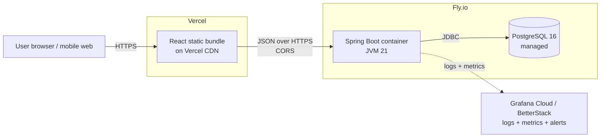

# Todo App — Implementation Plan

> **Living document.** Updated at the end of every logical unit. This file is the single source of truth for what we're building, why, how far we've gotten, and what's next. It is designed to be self-contained — a fresh Claude session should be able to pick up cold by reading only this file.

---

## Table of Contents
1. [Overview](#1-overview)
2. [Learning Objectives](#2-learning-objectives)
3. [Architecture](#3-architecture)
4. [Technology Choices](#4-technology-choices)
5. [Phase Plan](#5-phase-plan)
6. [Decision Log](#6-decision-log)
7. [Local Dev Guide](#7-local-dev-guide)
8. [Deployment Notes](#8-deployment-notes)
9. [Open Questions](#9-open-questions)
10. [Session Log](#10-session-log)

---

## 1. Overview

### What we're building
A standard todo-list web application with the usual features — create, read, update, delete, toggle-complete, filter — accessible from desktop browsers and mobile web. Data persists across sessions. Single-user in v1 (no auth; see §9).

### Why we're building it
This is a deliberate **learning project** for the author (GitHub: [`pranavgupta97`](https://github.com/pranavgupta97)), a senior software engineer with ~6 years of experience across the stack who has worked on complex systems with nuanced focus domains specializing primarily in back-end engineering and development, but has never personally taken a full-stack application system (with all its major database, back-end, and front-end components) from an empty repo all the way through to production deployment. The todo app itself is intentionally simple so that the *engineering discipline around it* — architecture, testing, CI/CD, containerization, hosting, observability — can be built out in full without application-domain complexity competing for attention.

### Success criteria
- Publicly accessible on the open internet via HTTPS (Vercel + Fly.io).
- All code is typed, tested, linted, and merged through pull requests.
- Automated CI on every push; automated deploy on merge to `main`.
- Structured logs and metrics visible in production.
- A developer can clone, set up, and run the full stack locally using the README alone.
- Every item in §2 (Learning Objectives) is checked off.

### Scope discipline
- **In scope:** CRUD on todos, completion toggle, filtering (all / active / completed), dark mode, persistence, responsive mobile-web-friendly layout.
- **Out of scope (v1):** multi-user authentication, sharing/collaboration, reminders or notifications, offline support, native mobile apps.

---

## 2. Learning Objectives

Checklist of concepts the author expects to have internalized by end of the project. Items are ticked off as they are demonstrably complete in the code + docs.

### Backend & Java
- [ ] Spring Boot 3.x project structure, IoC/DI, bean lifecycle
- [ ] Layered architecture: Controller → Service → Repository
- [ ] RESTful API design (resources, HTTP verbs, status codes, idempotency)
- [ ] DTO vs entity separation and why it matters
- [ ] Bean Validation (`jakarta.validation`) and validation-error mapping
- [ ] Global error handling via `@ControllerAdvice`
- [ ] Spring profiles for environment-based config (`dev`, `test`, `prod`)

### Database & Persistence
- [ ] Relational schema design for a simple domain
- [ ] JPA/Hibernate entity mapping and generated-SQL awareness
- [ ] Flyway migrations — versioning, naming, forward-only discipline
- [ ] PostgreSQL fundamentals in dev (Docker) and prod (Fly managed)
- [ ] Connection pooling (HikariCP) basics

### Frontend & TypeScript
- [ ] React 18 with strict-mode TypeScript
- [ ] Vite build tool
- [ ] Tailwind CSS utility-first styling
- [ ] Dark-mode implementation (class strategy, system-preference default, localStorage persistence)
- [ ] TanStack Query for server-state caching
- [ ] TypeScript client generated from OpenAPI spec (shared contract)
- [ ] Accessible, responsive layout

### Testing
- [ ] JUnit 5 unit tests with Mockito
- [ ] `@WebMvcTest` controller tests
- [ ] `@SpringBootTest` integration tests with Testcontainers (real Postgres)
- [ ] Vitest + React Testing Library for component/hook tests
- [ ] Playwright end-to-end test for one happy-path user journey

### DevOps & Deployment
- [ ] Docker images — layers, caching, multi-stage builds
- [ ] Dockerfile for Spring Boot (JVM multi-stage)
- [ ] Dockerfile for React static build (nginx-served)
- [ ] Docker Compose for local multi-service orchestration
- [ ] GitHub Actions — workflows, jobs, caches, secrets, matrix
- [ ] Container image publishing to GHCR
- [ ] Fly.io deployment — `fly.toml`, secrets, regions, volumes, scaling
- [ ] Vercel deployment — build config, env vars, preview deploys
- [ ] Managed Postgres in production
- [ ] TLS/HTTPS termination (platform-managed)

### Cross-cutting Concerns
- [ ] CORS — preflights, allowed origins, credentials
- [ ] Environment-based config — `.env` files, secrets handling, dev vs prod separation
- [ ] API versioning and backward-compatibility thinking
- [ ] Structured JSON logging with correlation IDs
- [ ] Metrics via Micrometer + Spring Actuator
- [ ] Health / readiness / liveness endpoints
- [ ] Production observability — log aggregation + alerting (Grafana Cloud or BetterStack)
- [ ] Git workflow — feature branches, PRs, protected main, commit hygiene
- [ ] System-architecture diagramming (Mermaid)
- [ ] Writing a comprehensive README with diagrams

---

## 3. Architecture

### Production topology

### Component responsibilities

| Component | Responsibility |
|---|---|
| **React frontend (Vercel)** | UI rendering, client-side validation, API client, theme toggle. Stateless beyond browser cache. |
| **Spring Boot API (Fly.io)** | Business logic, request validation, persistence, error handling, log + metric emission. |
| **PostgreSQL (Fly.io)** | Durable state. Schema versioned by Flyway. |
| **Vercel CDN** | Serves static bundle globally; TLS termination; per-PR preview deploys. |
| **Fly.io platform** | Container runtime; TLS termination; health checks; auto-restart. |
| **GHCR** | Container image registry. |
| **GitHub Actions** | CI (lint, typecheck, test, build) and CD (deploy on merge). |
| **Grafana Cloud / BetterStack** | Log aggregation, metrics dashboards, alert routing. |

### Request flow — "add a todo"

1. User submits form in the React app.
2. React calls `fetch('https://api.<host>/api/todos', { method: 'POST', body: ... })`.
3. Browser performs a **CORS preflight** (`OPTIONS`); backend responds with the allowed origin/methods/headers.
4. Browser sends the actual `POST`. Spring's `TodoController` receives it, validates the DTO, delegates to `TodoService`.
5. `TodoService` persists via `TodoRepository` (JPA). Flyway-managed schema is already in place.
6. Controller returns `201 Created` with a JSON representation of the created todo.
7. React's TanStack Query invalidates the todos cache → auto-refetches → UI updates.
8. Throughout: structured JSON logs with a correlation ID, Micrometer counters/timers incremented.

---

## 4. Technology Choices

All decisions made 2026-04-19 unless otherwise noted. Each row: what we picked, why, main alternatives considered.

| Concern | Chosen | Rationale | Alternatives considered |
|---|---|---|---|
| JDK | **Java 21 LTS (Temurin)** | Spring Boot's production-supported LTS baseline; long support window | JDK 17 (older), JDK 24 (non-LTS) |
| Build tool | **Maven** | Explicit XML; clearer errors for learners; every Spring tutorial uses it | Gradle (more idiomatic but steeper config curve) |
| Backend framework | **Spring Boot 3.4** | Industry-standard Java REST stack; vast ecosystem | Micronaut, Quarkus, Javalin |
| DB | **PostgreSQL 16** | Free, open, production-grade, ubiquitous | MySQL, SQLite (too limited for prod learning) |
| Migrations | **Flyway** | Simple versioned SQL; industry-standard | Liquibase (XML-heavy) |
| Frontend | **React 18 + TS (strict)** | Author uses at work; strict TS for type discipline | Vue, Svelte |
| Bundler | **Vite** | Fast, modern, minimal config | Next.js (overkill for SPA), CRA (deprecated) |
| Styling | **Tailwind CSS** | Speed + consistency; author already has CSS fundamentals | Vanilla CSS, CSS-in-JS |
| Server state | **TanStack Query** | Right tool for cached server state | Redux Toolkit Query, SWR |
| Client state | **useState / useReducer** | A todo app doesn't warrant a global store | Zustand, Redux |
| Testing (BE unit) | **JUnit 5 + Mockito** | Standard | TestNG, Spock |
| Testing (BE integration) | **`@SpringBootTest` + Testcontainers** | Real Postgres; fidelity prevents prod-mock divergence bugs | H2 in-memory (fidelity gap) |
| Testing (FE unit) | **Vitest + RTL** | Native Vite integration; Jest-compatible API | Jest |
| Testing (E2E) | **Playwright** | Fast, reliable, TS-first | Cypress |
| Containers | **Docker + Compose** | De facto standard | Podman |
| CI | **GitHub Actions** | Native to GitHub; generous free tier for public repos | CircleCI, GitLab CI |
| Image registry | **GHCR** | Native GitHub integration; free for public images | Docker Hub |
| Backend hosting | **Fly.io** | Container-based (real ops feel); generous free tier; managed Postgres; global regions | Render (sleeps on free tier), Railway (paid), AWS ECS (steep curve, cost risk) |
| Frontend hosting | **Vercel** | Best-in-class DX for React; preview deploys; CDN | Netlify, Cloudflare Pages |
| Observability | **Actuator + Micrometer + Grafana Cloud/BetterStack free tier** | Industry-standard primitives; free prod aggregation | Self-hosted Prometheus/Grafana (ops overhead) |
| Repo layout | **Monorepo** | Simpler solo dev; atomic cross-stack changes | Two repos |
| License | **MIT** | Permissive, standard | Apache-2.0 |
| Repo visibility | **Public** | Portfolio visibility; no secrets committed | Private |

---

## 5. Phase Plan

**Status legend:** ⏳ Not started · 🔄 In progress · ✅ Done

### Phase 1 — Dev environment setup ✅ Done (2026-04-19)
**Goal:** Local machine ready to build Java + React + containers.
**Deliverables:** SDKMAN, JDK 21.0.5-tem, Maven 3.9.15, `gh` 2.90 (authenticated as `pranavgupta97`), pnpm 10.33 installed and verified.
**Exit criteria:** `java -version`, `mvn -version`, `gh auth status`, `pnpm --version` all green. ✅

### Phase 2 — Repository bootstrap ✅ Done (2026-04-19)
**Goal:** GitHub repository created with baseline project scaffolding.
**Deliverables:**
- Local directory `/Users/pranavgupta/Code/todo-app/`
- Root files: `.gitignore`, `.editorconfig`, `LICENSE` (MIT), `README.md`, this plan doc
- `docs/` with placeholder
- Initial `git init` commit, remote repo `pranavgupta97/todo-app` (public), `main` branch pushed
**Exit criteria:** Repo visible at `https://github.com/pranavgupta97/todo-app`; README renders; plan doc committed.

### Phase 3 — Backend skeleton ✅ Done (2026-04-19)
**Goal:** Minimal Spring Boot app that starts and serves a health check.
**Deliverables:** Spring Boot 3.5.x project via Initializr (Web, Validation, JPA, Flyway, Postgres driver, Actuator, Testcontainers, DevTools, Docker Compose Support). Main class + default Initializr test scaffolding (`TestcontainersConfiguration`, `TestTodoAppApplication`).
**Exit criteria:** `./mvnw clean verify` green; `./mvnw spring-boot:run` → `/actuator/health` returns `{"status":"UP"}`. ✅

### Phase 4 — Domain + REST API 🔄 In progress
Split into two sub-units merged via one PR on branch `phase-4/...`:
- **Phase 4a — Backend cleanups (before domain work):** YAML config split (`application.yml` + `-dev` + `-test`), package skeleton + `package-info.java` for each, pin Postgres image version to `16-alpine`, tighten test configuration.
- **Phase 4b — Domain + CRUD API:** `Todo` entity, Flyway `V1__create_todos.sql`, DTOs as records, service, controller, global error handler, `.http` files for manual testing.
**Goal:** Full CRUD for the `Todo` resource.
**Deliverables:** `Todo` entity; `TodoDto`, `CreateTodoRequest`, `UpdateTodoRequest`; `TodoController`, `TodoService`, `TodoRepository`; input validation; `@ControllerAdvice` global error handler; `.http` files in `backend/requests/` for manual testing from IntelliJ.
**Exit criteria:** All CRUD endpoints (plus toggle-complete) work; request/response shapes documented.

### Phase 5 — Persistence with Postgres + Flyway ⏳
**Goal:** Real Postgres running locally in Docker; schema managed by Flyway.
**Deliverables:** `infra/docker-compose.dev.yml` with Postgres 16; Flyway migration `V1__create_todos.sql`; `dev` profile wired to Docker DB; repository integration tests using Testcontainers.
**Exit criteria:** App starts against Docker Postgres; migrations apply cleanly; integration tests green.

### Phase 6 — Backend test suite ⏳
**Goal:** Comprehensive backend tests at every level.
**Deliverables:** Service-layer unit tests (JUnit 5 + Mockito); controller tests (`@WebMvcTest`); full-stack integration tests (`@SpringBootTest` + Testcontainers). Coverage report (JaCoCo) in CI.
**Exit criteria:** `mvn test` green; coverage report generated.

### Phase 7 — API contract (OpenAPI) ⏳
**Goal:** Auto-generated OpenAPI spec; serves as shared contract for frontend.
**Deliverables:** `springdoc-openapi` added; Swagger UI at `/swagger-ui.html`; `openapi.yaml` exported under `docs/api/` and kept in sync via CI.
**Exit criteria:** Swagger UI lists all endpoints with schemas; exported spec validates.

### Phase 8 — UI/UX Design & Mock-up (Discussion + Approval) ⏳
**Goal:** Agree on look, feel, and flow *before* writing any React.
**Deliverables:**
- Design discussion doc capturing: color palette, typography, spacing scale, light+dark theme hues/gradients, responsive breakpoints
- Standalone HTML + Tailwind mock-up at `docs/mockup.html` — openable in a browser
- User-flow Mermaid diagram added to README §User Workflow
**Exit criteria:** Author explicitly approves mock-up visuals and flow.

### Phase 9 — Frontend skeleton ⏳
**Goal:** Vite + React + TS project scaffolded, styled, with mock UI wired to no backend yet.
**Deliverables:** `frontend/` created via Vite template; strict TS; Tailwind configured with class-based dark mode; ESLint + Prettier; base layout matching approved mock; probably a single page (no router yet).
**Exit criteria:** `pnpm dev` serves the mock UI at `localhost:5173`.

### Phase 10 — Frontend implementation (wired to backend) ⏳
**Goal:** Fully functional todo UI talking to live local API.
**Deliverables:**
- OpenAPI-generated TS client (`openapi-typescript` + `openapi-fetch`)
- TanStack Query hooks for CRUD
- Components: `TodoList`, `TodoItem`, `NewTodoForm`, `FilterBar`, `ThemeToggle`, `EmptyState`, `ErrorBoundary`
- Dark mode toggle — system-preference default, persisted in `localStorage`
- Responsive layout verified at mobile breakpoint
**Exit criteria:** Full CRUD works end-to-end locally with the backend running.

### Phase 11 — Frontend test suite ⏳
**Goal:** Test coverage for frontend logic plus one E2E happy path.
**Deliverables:** Vitest unit tests for hooks and key components; Playwright E2E exercising add → complete → filter → delete.
**Exit criteria:** `pnpm test` and `pnpm e2e` green in CI.

### Phase 12 — Local full-stack via Docker Compose ⏳
**Goal:** Single `docker compose up` runs DB + backend + frontend locally, production-like.
**Deliverables:** `backend/Dockerfile` (multi-stage JVM build); `frontend/Dockerfile` (nginx serving static build); `infra/docker-compose.yml` for full stack; `infra/docker-compose.dev.yml` remains DB-only for active dev.
**Exit criteria:** `docker compose up` → app loads at `localhost:3000`, backend at `localhost:8080`, Postgres at `5432`.

### Phase 13 — Observability ⏳
**Goal:** Structured logs + metrics + correlation IDs emitted by the backend.
**Deliverables:** Logback JSON encoder (`logstash-logback-encoder`); request filter that assigns and propagates `X-Request-Id`; Micrometer metrics at `/actuator/prometheus`; readiness and liveness probes configured for the container.
**Exit criteria:** Sample structured log line + Prometheus scrape visible locally.

### Phase 14 — Continuous Integration ⏳
**Goal:** GitHub Actions pipeline running on every push and PR.
**Deliverables:**
- `.github/workflows/ci.yml` with jobs: backend (lint + test + build + image push to GHCR), frontend (lint + typecheck + test + build + image push to GHCR)
- Maven and pnpm caches
- Branch protection on `main` requiring CI green
- Dependabot config
**Exit criteria:** Green CI on a non-trivial PR; images visible in GHCR.

### Phase 15 — Deployment (production) ⏳
**Goal:** Public, HTTPS-served production on Fly.io + Vercel.
**Deliverables:**
- Fly.io app for backend (`fly.toml`, secrets, region), managed Postgres attached via `DATABASE_URL`
- Vercel project for frontend (build config, `VITE_API_URL` env var)
- CD workflow: merge to `main` → deploy both
- CORS allowed-origin = production frontend URL
- Subdomain-based API origin
**Exit criteria:** Public URL accessible from phone browser; full CRUD works against prod.

### Phase 16 — Production observability ⏳
**Goal:** Logs, metrics, alerts, and uptime visibility for the deployed app.
**Deliverables:** Log shipping to Grafana Cloud or BetterStack free tier; basic dashboard (request rate, error rate, p95 latency); uptime monitor; at least one alert rule.
**Exit criteria:** A deliberately failed request triggers an alert; dashboard visible.

### Phase 17 — Polish ⏳
**Goal:** Project ready to share as a portfolio artifact.
**Deliverables:** README completed (final architecture diagram, full setup guide, screenshots, live URL); user-flow diagram; a short writeup reflecting on each learning objective; every item in §2 checked.
**Exit criteria:** A cold reader can understand, run, and deploy this project from the README alone.

---

## 6. Decision Log

| Date | Decision | Rationale | Alternatives rejected |
|---|---|---|---|
| 2026-04-19 | Use Java 21 LTS (Temurin) | Production LTS baseline; Spring Boot's supported track | JDK 17 (older), JDK 24 (non-LTS) |
| 2026-04-19 | Use Maven (not Gradle) | Explicit, readable, learner-friendly | Gradle |
| 2026-04-19 | Monolithic backend (single Spring Boot service) | A todo app doesn't warrant microservices; avoids distracting ops complexity | Microservices split |
| 2026-04-19 | Monorepo layout | Easier atomic cross-stack changes; simpler CI | Two repos |
| 2026-04-19 | Separate deploys for FE and BE | Learning goal: exercise CORS, independent deploys, env-based API URL injection | Serving the React bundle from Spring Boot |
| 2026-04-19 | Tailwind CSS | Pace + consistency; author already has CSS fundamentals | Vanilla CSS, CSS-in-JS |
| 2026-04-19 | TanStack Query for server state (no Redux/Zustand) | Right tool for cached server state; local state is trivial | Redux Toolkit Query, global stores |
| 2026-04-19 | Testcontainers (not H2) for integration tests | Real Postgres catches real bugs; mock/prod fidelity matters | H2 in-memory |
| 2026-04-19 | Fly.io for backend + Postgres; Vercel for frontend | Fly = container-based real-ops feel + managed PG; Vercel = best React DX; both free tier | Render (sleeps), Railway (paid), AWS (cost + curve) |
| 2026-04-19 | Skip custom domain in v1 | Use free `*.fly.dev` + `*.vercel.app` until there's something worth pointing at | Buying a domain upfront |
| 2026-04-19 | MIT license, public repo | Portfolio visibility; permissive terms | Apache-2.0, private |
| 2026-04-19 | No authentication in v1 | Keeps scope focused; can add as a learning extension later | Basic auth / JWT / OAuth upfront |
| 2026-04-19 | Spring Boot **3.5.x** (not 4.0.x) | 4.0 is brand new; tiny docs/community footprint. 3.5 has massive tutorial/StackOverflow coverage, which matters for a learning project. Java 21 is fully supported on 3.5. Novel `-test` starter split in 4.0 adds friction. | Spring Boot 4.0.5 (initial attempt, rolled back) |
| 2026-04-19 | Default Spring profile is `dev`; tests activate `test` via `@ActiveProfiles` | Makes local `./mvnw spring-boot:run` "just work" without flags, while tests get explicit quieter logging and no docker-compose auto-start | Always require explicit profile flag; or merge all config into base |
| 2026-04-19 | Pin `postgres:16-alpine` (not `:latest`) everywhere | Floating `:latest` tags are a well-known footgun — reproducibility and prod/dev parity require a pinned version | Use `postgres:latest` |

---

## 7. Local Dev Guide

> Grows with each phase. Everything here should be copy-pasteable.

### Prerequisites (one-time)
Install per Phase 1: JDK 21 via SDKMAN, Maven, `gh`, pnpm, Docker Desktop.

### After cloning
_(Populated in Phase 3 and expanded each phase.)_

---

## 8. Deployment Notes

> Placeholder until Phase 15.

- **Backend:** Fly.io app (name TBD), region TBD, image pulled from GHCR.
- **Database:** Fly.io managed Postgres, attached to backend app via `DATABASE_URL` secret.
- **Frontend:** Vercel project, env `VITE_API_URL=https://<api-host>`.
- **CI/CD:** merge to `main` → GitHub Actions builds + pushes images → Fly deploys backend → Vercel deploys frontend.

### Secrets strategy
- **Never commit secrets.** `.env` files are gitignored.
- **Local dev:** `.env.example` is committed with dummy values; real `.env` is per-developer.
- **CI:** repository secrets for GHCR token, Fly API token, Vercel token.
- **Runtime:** Fly secrets for `DATABASE_URL` and other backend config; Vercel env for `VITE_API_URL`.

---

## 9. Open Questions

- **Authentication in a later version?** v1 is single-user / no auth. If we want to demo multi-user later, we'd add OIDC (Google sign-in via Spring Security OAuth2 client) — decide after Phase 17.
- **Mobile PWA manifest?** Would make the app installable on phones; small effort, decide in Phase 10.
- **Analytics?** Nice-to-have for portfolio demo; defer to Phase 17.
- **Custom domain?** Skipped for v1; revisit after first deploy if the project sticks.

---

## 10. Session Log

### 2026-04-19 — Session 1: Alignment, planning, Phases 1–2
- Established goals, author background, the specific learning gap this project closes.
- Locked in stack: Java 21 · Spring Boot · Postgres · React 18 · TS · Tailwind · TanStack Query · Docker · GitHub Actions · Fly.io + Vercel.
- Clarified monorepo-with-separate-deploys vs monolith-vs-microservice terminology.
- Confirmed collaboration preferences: user runs all build/test/git commands; Claude writes code, explains, and guides.
- **Phase 1 (Dev env setup):** installed SDKMAN 5.22, JDK 21.0.5-tem, Maven 3.9.15, gh 2.90 (authenticated), pnpm 10.33. Verified. ✅
- **Phase 2 (Repo bootstrap):** scaffold files created locally (`.gitignore`, `.editorconfig`, `LICENSE`, `README.md`, this plan doc, `docs/.gitkeep`). Repo created and initial commit pushed to `main` at https://github.com/pranavgupta97/todo-app. ✅
- **Phase 3 (Backend skeleton):** initial Initializr attempt on Spring Boot 4.0.5 hit friction (Docker daemon + novel test-starter pattern); rolled back to 3.5.x for a much larger docs/community footprint. Build green, health endpoint UP. Merged via PR #1. ✅
- **Phase 4a (Backend cleanups):** `application.properties` → `application.yml` + `application-dev.yml` + `application-test.yml`; package skeleton (`controller`, `service`, `repository`, `domain`, `config`, `exception`) with `package-info.java` in each; pinned Postgres image to `postgres:16-alpine` in `compose.yaml` and `TestcontainersConfiguration`; added `@ActiveProfiles("test")` to smoke test; `TestTodoAppApplication` now disables docker-compose to avoid double-provisioning Postgres in dev.
